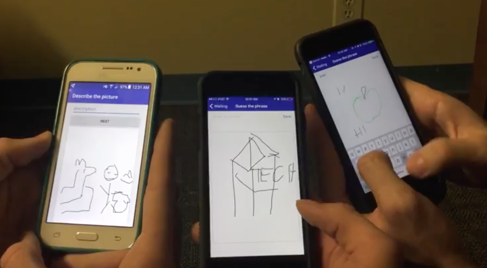

# Telephone Pictionary
Telephone Pictionary is a party game for iOS and Android. 

This project won **"Most Technical Hack"** at DerbyHacks 2017 in Louisville, KY.

## Gameplay

In a real life game of Telephone Pictionary, each player starts with stacks of index cards that get passed around the circle. Players write a phrase on the their first card and then pass their stack to the left. The next player tries to draw a picture that represents the phrase, and then the next player writes a phrase they think represents the picture. This continues until the player's original stack comes back to them. At that point, they can look through the stack to see how their phrase evolved over time.

## Screenshots

  

## Demo

**[Watch a video demo](https://www.youtube.com/watch?time_continue=47&v=gTzzDBmKUqM)**

